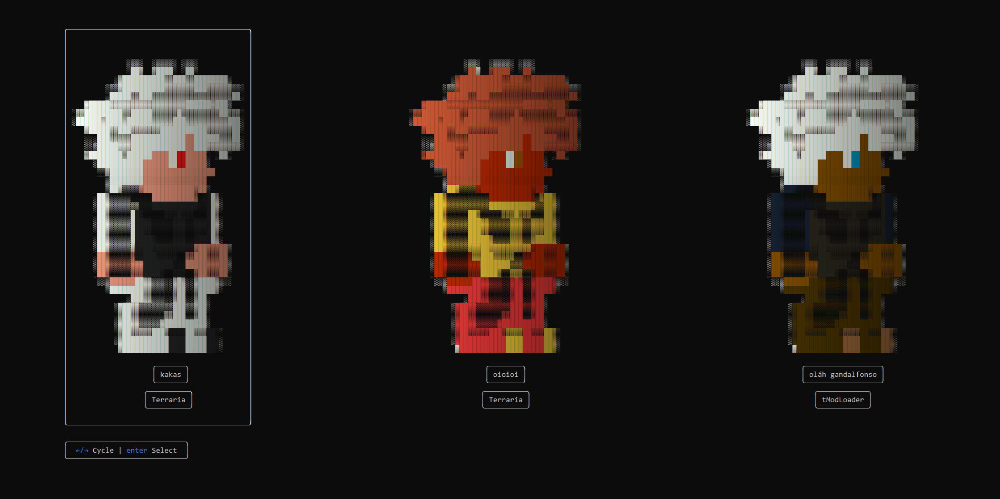

A Terminal based **Terraria** Character Editor.

### Feautures
- Simple menu for player file selection(Automatically pulled from the player file locations)
- Player sprite render with the players colors(With the default clothing and hair)
- Player base stats
- Inventory
- Armor/Dyes/Accessories
- Banks
- Buffs
- UI based inventory editing
- Serialization saves changed data
- Ascii art image of the selected item

### Planned Feautures
- Hot reloading character(if possible, i will see)

